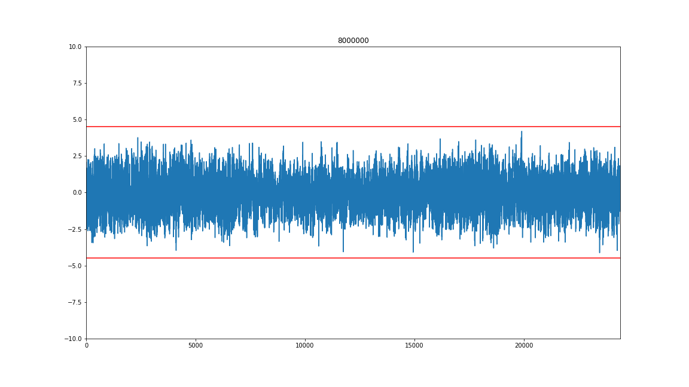
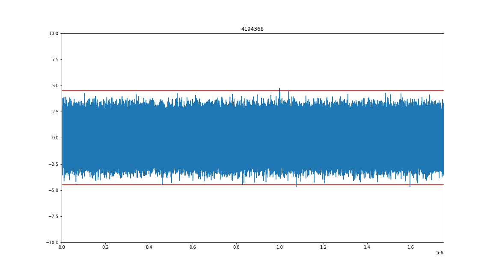
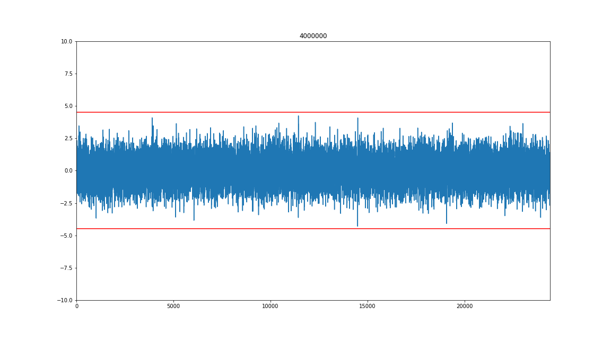
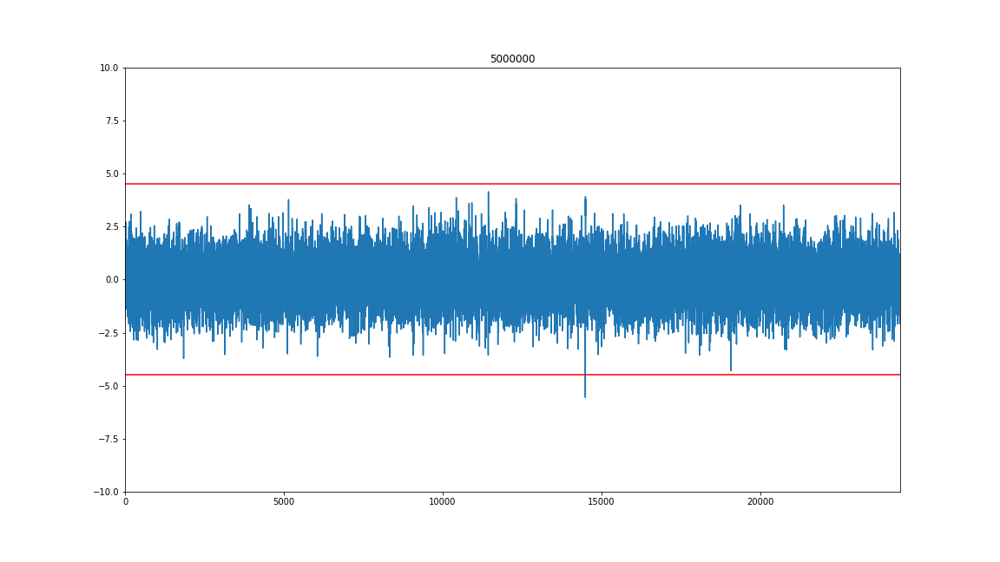
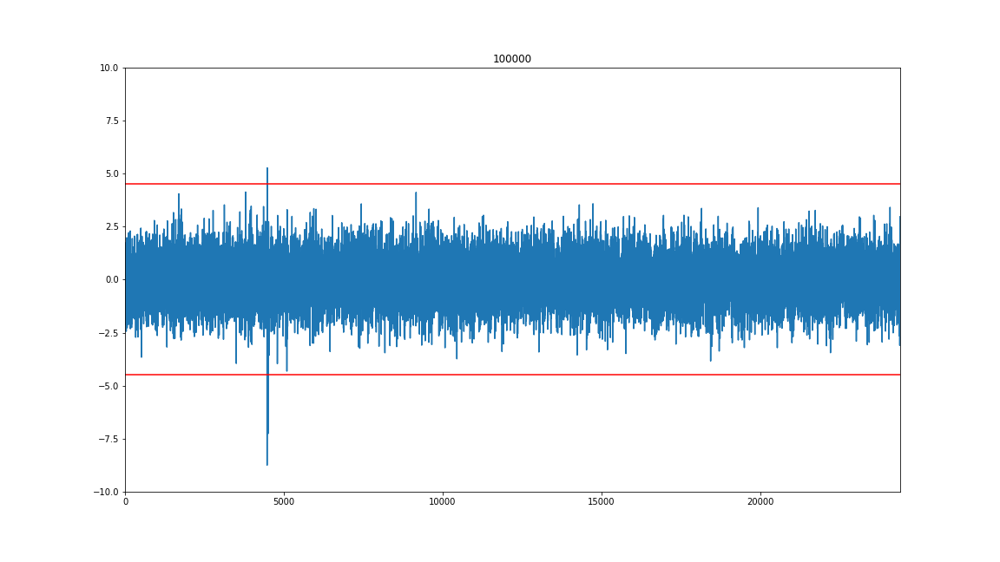
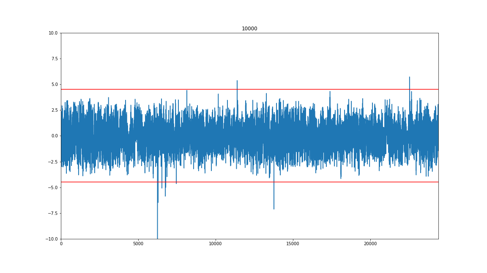

# Masked Ascon Software Implementations

This repository contains high-level masked (shared) [Ascon](https://ascon.iaik.tugraz.at/)
software implementations, mostly written in C. These implementations can be used
as a starting point to generate device specific C/ASM implementations.

Masked C implementations requires a minimum amount of ASM instructions.
Otherwise, the compiler may heavily optimize the code and even combine
shares. Obviously, the output generated is very sensitive to compiler and
environment changes and any generated output needs to be security evaluated.

A preliminary evaluation of these implementations has been performed on some
[ChipWhisperer](https://www.newae.com/chipwhisperer) devices. The results can
be reproduced by performing the following steps:

- Make sure this repository is checked out in the `hardware/victims/firmware` folder of your chipwhisperer installation.
- Make sure the `jupyter/*.ipynb` scripts are located in the `jupyter` folder of your chipwhisperer installation.
- Run the shared simpleserial interface jupyter script `jupyter/ascon_sca_sss.ipynb`.

The masked software interface follows the
[Call for Protected Software Implementations](https://cryptography.gmu.edu/athena/LWC/Call_for_Protected_Software_Implementations.pdf)
of the [Cryptographic Engineering Research Group](https://cryptography.gmu.edu/)
for finalists in the
[NIST Lightweight Cryptography Competition](https://csrc.nist.gov/projects/lightweight-cryptography).
The number of shares are defined by the parameters `NUM_SHARES_KEY`,
`NUM_SHARES_NPUB`, `NUM_SHARES_AD`, `NUM_SHARES_M` and `NUM_SHARES_C` in the
`api.h` file.

Additionally, most masked Ascon implementations assume that the shares are
(32/64-bit) rotated against each other using the parameter `ASCON_ROR_SHARES`
defined in the `api.h` file. The Ascon specific masking and rotation functions are
defined in the Python functions `generate_shares` and `combine_shares` as well
as in the C functions `generate_shares_encrypt`, `generate_shares_decrypt`,
`combine_shares_encrypt` and `combine_shares_decrypt`.

Note that an `ASCON_ROR_SHARES` value of `x` corresponds to a right rotation of
each internal 32-bit share `i` by `x*i mod 32` bits. For 32-bit interleaved
implementations of Ascon, this corresponds to a right rotation of
each 64-bit share `i` by `2*x*i mod 32` bits at the interface level.

# Protection Methods

- Name of the applied countermeasures:
  * Masking with (almost) no fresh randomness
  * Rotation of shares against each other
  * Mode-level security (mask init/final, plain ad/pt/ct)

- Tag comparison:
  * XOR masked tag to state (x3,x4)
  * Set remaining state to masked zero
  * Compute masked PB permutation
  * Plain comparison of result with known output of PB(0)

- Available implementations:
  * `protected_bi32_armv6` supporting 2, 3, 4 rotated shares (equal number of
    shares for key, nonce, adata, plaintext and ciphertext)
  * `protected_bi32_armv6_leveled` supporting 2, 3, 4 rotated shares for key
    and 1 share for nonce, adata, plaintext and ciphertext

- Primary references for masking Ascon:
  * Joan Daemen, Christoph Dobraunig, Maria Eichlseder, Hannes Groß, Florian Mendel,
    Robert Primas: "Protecting against Statistical Ineffective Fault Attacks".
    CHES 2020. https://doi.org/10.13154/tches.v2020.i3.508-543
  * Aein Rezaei Shahmirzadi, Amir Moradi: "Second-Order SCA Security with almost no
    Fresh Randomness". CHES 2021. https://doi.org/10.46586/tches.v2021.i3.708-755
  * Hannes Groß, Stefan Mangard: "Reconciling d+1 Masking in Hardware and Software".
    CHES 2017. https://eprint.iacr.org/2017/103

- Primary references for mode-level security of Ascon:
  * Alexandre Adomnicai, Jacques J. A. Fournier, Laurent Masson: "Masking the
    Lightweight Authenticated Ciphers ACORN and Ascon in Software". Cryptology
    ePrint Archive, Report 2018/708. https://eprint.iacr.org/2018/708
  * Davide Bellizia, Olivier Bronchain, Gaëtan Cassiers, Vincent Grosso, Chun
    Guo, Charles Momin, Olivier Pereira, Thomas Peters, François-Xavier
    Standaert: "Mode-Level vs. Implementation-Level Physical Security in
    Symmetric Cryptography - A Practical Guide Through the Leakage-Resistance
    Jungle". CRYPTO 2020. https://eprint.iacr.org/2020/211

# Experimental Setup

- Measurement platform and device-under-evaluation:
  * ChipWhisperer, CW308 with STM32F303 UFO target
  * ChipWhisperer, CW308 with STM32F415 UFO target
  * ChipWhisperer, CW308 with STM32F405 UFO target

- STM32F303, STM32F415:
  * Oscilloscope: ChipWhisperer Lite Scope
  * Measurement: see ChipWhisperer specification
  * Sampling rate: clkgen x4

- STM32F405:
  * Oszilloscope: Picoscope 6404d
  * Measurement: CW501 differential probe
  * Sampling rate: 1GS

The experimental setup and evalutions for STM32F303 and STM32F415 are
given in the jupyter scripts in this repository.

# Attack/Leakage Assessment Characteristics

- Data inputs and performed operations:
  * encrypt/decrypt using plain CW simpleserial interface defined in
    `jupyter/ascon_sca.ipynb`
  * encrypt/decrypt using shared CW simpleserial interface defined in
    `jupyter/ascon_sca_sss.ipynb`
  * STM32F303 and STM32F415: `ASCON_PA_ROUNDS` and `ASCON_PB_ROUNDS` reduced to
    2 rounds to mostly fit within 24400 samples

- Source of random and pseudorandom inputs:
  * STM32F415: randombytes.c using STM32F415 hardware RNG
  * STM32F303 and STM32F415: custom randombytes.c function using stdlib.h
    rand() and srand()
  * Python random.getrandbits function for shared interface

- Trigger location relative to the execution start time of the algorithm:
  * Prior and after the call to `crypto_aead_encrypt_shared` and
    `crypto_aead_decrypt_shared`

- Time required to collect data for a given attack/leakage assessment:
  * 30 iterations/second using a target baud rate of 230400
  * 8 iterations/second using a target baud rate of 38400

- Total time of the attack/assessment:
  * About 9 hours per 1 million traces

- Total size of all traces: not stored

# Attack Specific Data

- Number of traces used: up to 8M depending on device and implementation

- Attack point:
  * trigger prior and after `crypto_aead_encrypt_shared`
  * trigger prior and after `crypto_aead_decrypt_shared` (with final `ascon_iszero`)
  * key, nonce and data are assumed to be randomly masked in each en/decryption

- Attack/leakage assessment type: Test Vector Leakage Assessment with
  * fixed key, fixed nonce, fixed 4-byte adata, fixed 4-byte plaintext (ciphertext) vs.
  * fixed key, random nonce, random 4-byte adata, random 4-byte plaintext (ciphertext)

- Note that using mode-level countermeasures, parts of the computations are
  computed in plain. This is the case for the final `ascon_iszero` function
  or large parts of the `protected_bi32_armv6_leveled` implementation. Plain
  computations need to be excluded from the t-test evaluation by setting the
  trigger locations accordingly.

# Documentation of Results

Attack script using shared simpleserial interface: `jupyter/ascon_sca_sss.ipynb`

Note that for the ChipWhisperer Lite Scope only the first 24400 samples have
been recorded. To cover larger parts of the implementation, the number of rounds
have been reduced to 2 rounds for PA and PB. This results in about 25000 samples
for decrypt and slightly less than 25000 samples for encrypt using 2 shares and
clkgen x4.

## 3 rotated shares

- Decryption (2 PA/PB rounds) of `protected_bi32_armv6` on STM32F303 using
  3 rotated shares and 8M traces:  
  

## 2 rotated shares with device specific fixes

Contrary to 3 shares, masking software implementations using only 2 shares is a
much more difficult challenge, since the 2 shares might easily collide in
hardware. Although rotating the shares reduces the number of possible situations
where these 2 shares may collide, device specific fixes are usually still needed
at some places. 

The device specific fix for the STM32F405 and STM32F415 targets is to add a
`MOV <rd>, #0` instruction between locations where shares are unrotated (e.g.
during bit interleaving or in non-linear functions). Similar fixes might exist
for other devices.

- Encryption (12/6 PA/PB rounds) of `protected_bi32_armv6` on STM32F405 using
  2 rotated shares, device specific fixes, external bit interleaving
  (can be computed offline, does not depend on key) and ~4.2M traces:  
  

- Decryption (2 PA/PB rounds) of `protected_bi32_armv6` on STM32F415 using
  2 rotated shares with device specific fixes and 4M and 5M traces:  
    
  

## 2 rotated shares without device specific fixes

Without device specific fixes, peaks in the t-test are shown after a low number
of traces (<10k). In the following we show such example graphs.

- Decryption (2 PA/PB rounds) of `protected_bi32_armv6` on STM32F415 using
  2 rotated shares, without device specific fixes and 100k traces:  
  

- Decryption (2 PA/PB rounds) of `protected_bi32_armv6` on STM32F303 using
  2 rotated shares, without device specific fixes and 10k traces:  
  

# Authors

Florian Dietrich, Christoph Dobraunig, Florian Mendel, Robert Primas, Martin Schläffer

[//]: # (pandoc --number-sections --from markdown README.md -o Documents/documentation.pdf)

